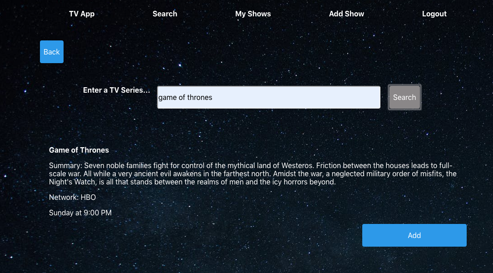
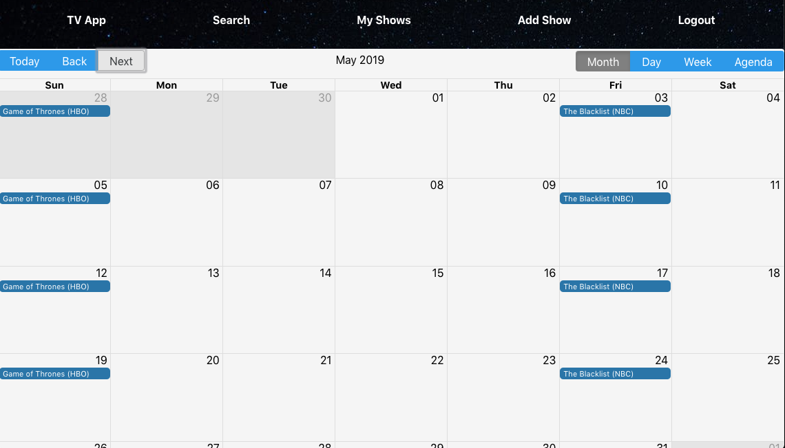

<h1>TV App</h1>
The TV App allows users the ability keep track of the air times of their favorite shows. They are able to make searches for and add shows to a list and the app will put the shows on a calendar telling them when those shows will air. The search feature uses the TheTVDB API, so if the search query that was entered is not in TheTVDB, users are can manually add the show themselves. Users also have the ability to edit the title, time, day, network, summary, and duartion of the show.    

**Live link: https://matt-tv-app.matth3wn.now.sh/**  

Demo user:  
- username: taco
- password: passworD1!  
  

<h2>API Documentation:</h2>

Base API URL: https://afternoon-crag-65094.herokuapp.com/api

Schema: All data is sent and received as JSON.

**Available Endpoints:**
- /auth/login POST
- /auth/refresh POST
- /users POST
- /shows POST
- /shows GET
- /shows DELETE
- /myshows/:id GET
- /myshows/:id PATCH

  
**Technology used**
- Postgres
- Express
- React
- Node.js

<!--    
  Parameters:  
  
 
    full_name: string   
    user_name: string    
    password: string     
  

 
  Response:
  

  201  
  {  
  &#160;&#160;"id":3,  
  &#160;&#160;"full_name":"new user",  
  &#160;&#160;"user_name":"taco1",  
  &#160;&#160;"date_created":"2019-03-29T17:40:36.949Z"
   
  } 
  

  

  400  
  {  
    &#160;&#160; error: 'error message'
   
  } 
  
 --> 